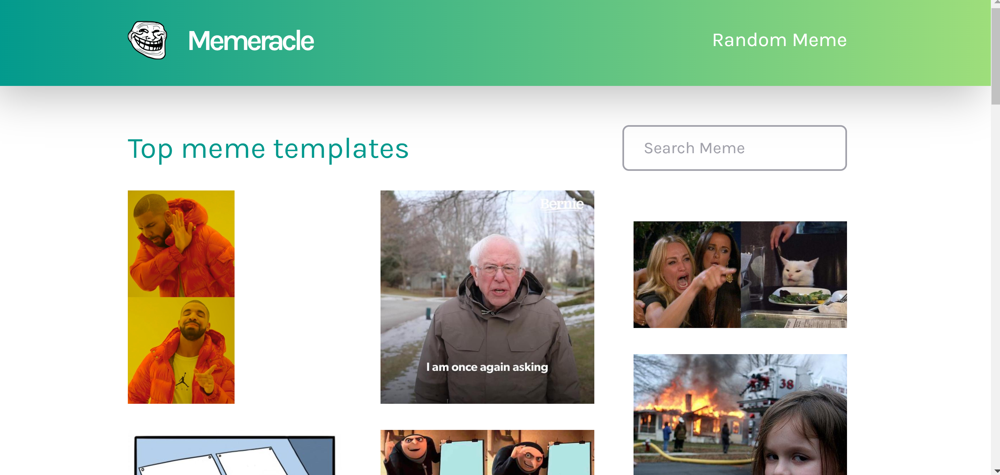
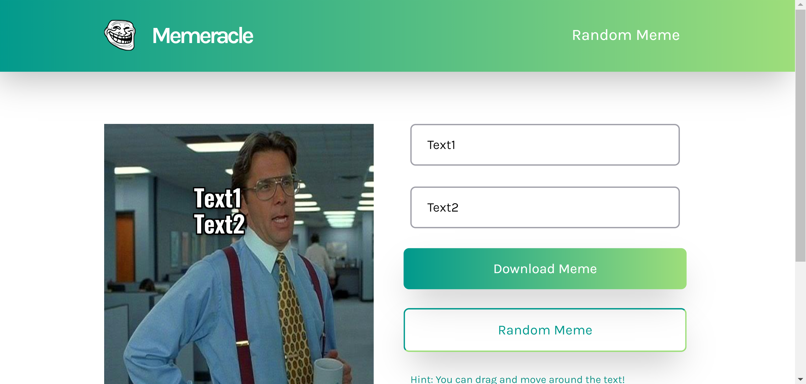
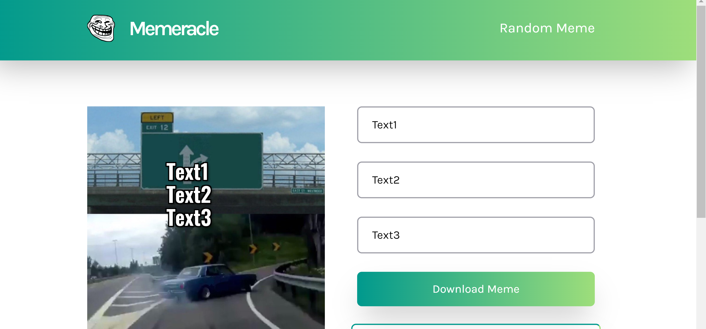

This is all of fakes
## Memeracle - Make your own memes

Memeracle is an open source, react-built, meme generator.

You can check it out here 👇

Live site - [Click here](https://memeracle.vercel.app)

## Installation

To install and run this project locally follow these steps:

1. [Fork](https://github.com/Dharmik48/meme-generator/fork) this repository
2. Click the 'code' drop down and depending on how you prefer to clone, clone your fork. This step can be done several different ways and is up to personal preference.

   - if you use HTTPS or SSH to clone run

   ```
   git clone https://github.com/<your-github-username>/meme-generator
   ```

   - if you use GitHub CLI run

   ```
   gh repo clone https://github.com/Dharmik48/meme-generator
   ```

   - alternatively you can open the project in GitHub desktop or download it as a ZIP.

   To read more about the different ways to clone a project you can read more [here](https://docs.github.com/en/repositories/creating-and-managing-repositories/cloning-a-repository)

3. After cloning your fork to your machine, navigate to it in your terminal

```
cd meme-generator
```

4. From within the projects directory, run the following command to install dependencies

```
npm install
```

5. Again, from within the projects directory, run the following command

```
npm start
```

This should start the dev server in your browser. If you're having any environment issues during installation open an issue describing the problem.

## Examples

Here are some screenshot examples of the app







## Contribution

You need 0 coding knowledge to contribute to the project! Some good ideas for first issues are updating documentation, suggesting some design improvements, making PR templates and so much more!

Just raise an [issue](https://github.com/Dharmik48/meme-generator/issues/new) for it

Please read [CONTRIBUTING](https://github.com/Dharmik48/meme-generator/blob/main/CONTRIBUTING.md) for a full guide to contributing to this project.

## 💪 Thanks to all Contributors

Thanks a lot for spending your time helping Meme Generator grow. Thanks a lot! Keep rocking 🍻

[](https://github.com/Dharmik48/meme-generator/graphs/contributors)
